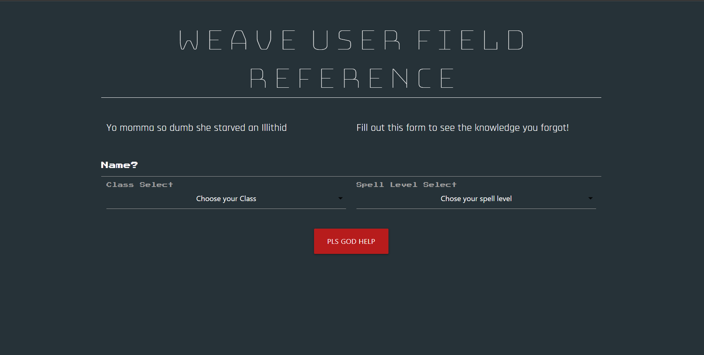

# W.U.F.R. = Weave Users Field Reference

- Dungeons and Dragons is an amazing game with a wide variety of content ranging from official to homebrew, with more being added every day. One of the core aspects of this game, and of fantasy in general, is the aspect of spells, but with almost 500 spells, it can be a bit overwhelming for newcomers, consider this….

## Scenario:

- You encounter a monster on the continent of Faerûn. You are fairly confident that you are a magic user but do not know what spells to use. Given the complexity of how magic works in this world, you want to know what spells you can utilize against your foe at your current player level.

## Purpose:

- This W.U.F.R. allows you to input your name, class, and player level to figure out what spells you can utilize at your current class player level.

## Screenshot of Deployed Website:

## Link: https://farrelldianni.github.io/Weave-User-Field-Reference/

### Created By: Farrell Dianni, Madeline Burns, Frank Kobe, and Brian Koo
